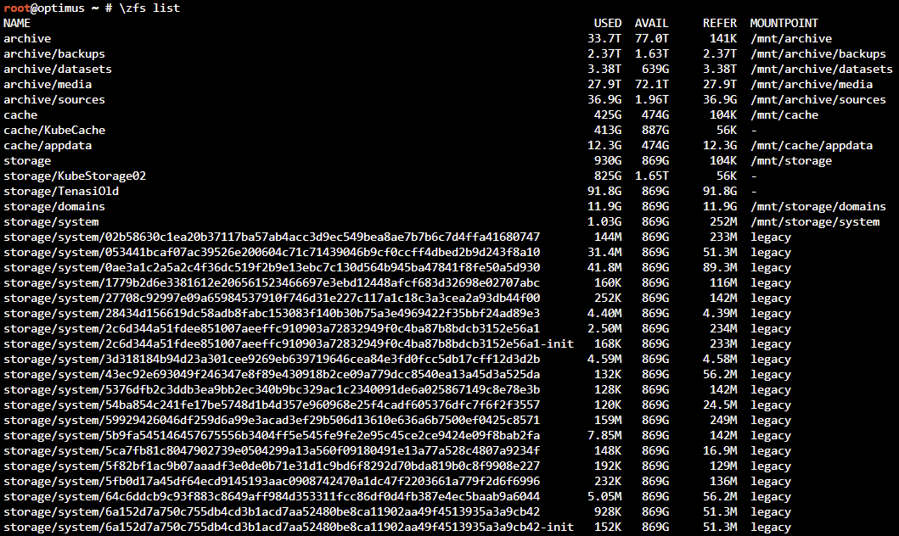
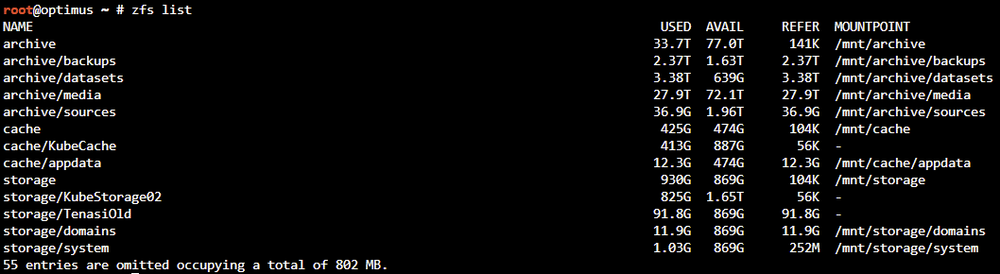

# ZFS Reduced
This is a small wrapper around the `zfs` command to hide Docker system images from `zfs list`. When using the zfs storage driver, Docker will create a lot of images named after a long alpha numeric string and pollute your output. This can be quite annoying if you have a lot of Docker containers. ZFS Reduced will hide those images from the output and let you know how many 

# Installation
## Bash
If you use bash, append the contents of the .bash file in this repository to your .bash file. Make sure to replace `DOCKER_PATH=storage/system/` with the path shown when running `zfs list`.

## ZSH
If you use zsh, append the contents of the .zshrc file in this repository to your .zshrc file. Make sure to replace `DOCKER_PATH=storage/system/` with the path shown when running `zfs list`.

# Usage
Just use by running any `zfs` command. When running `zfs list` the images will be omitted from the output. In case you do want to see the full output, add a trailing backslash to your command e.g. `\zfs list`.

# Screenshots

## ZFS List with Docker Images

## ZFS List with Docker Images
